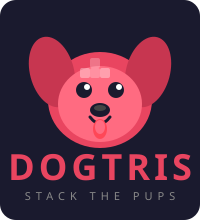

<p align="center">
  
</p>

<h1 align="center">DOGTRIS</h1>

<p align="center">
  <strong>The only Tetris game where every piece is a very good boy (or girl).</strong><br>
  <em>No treats were harmed in the making of this game.</em>
</p>

<p align="center">
  
  
  
  
</p>

---

## What in the Woof?

**Dogtris** is a fully playable Tetris clone where every falling piece is made of adorable, randomly-fetched dog photos. That's right -- instead of boring colored blocks, you're stacking Labradors, Pomeranians, Huskies, and whatever magnificent mutt the internet throws at you.

Every time you start a new game, 7 fresh puppers are fetched from the [Dog CEO API](https://dog.ceo/dog-api/) and assigned to each of the 7 classic Tetris piece shapes. Your I-piece might be a Dachshund. Your T-piece? A Golden Retriever. The O-piece is definitely giving Pug energy.

It's like regular Tetris, except you feel guilty clearing lines because those dogs looked so happy stacked together.

## How to Play

### Getting Started

1. Open `index.html` in any modern browser
2. Wait for the pups to load (they're worth the wait, we promise)
3. Click **Start Game**
4. Stack dogs. Clear lines. Try not to say "aww" every 3 seconds.

That's it. No `npm install`. No build step. No webpack config that makes you question your life choices. Just one HTML file and a dream.

### Controls

| Key | Action | Dog Translation |
|-----|--------|-----------------|
| `Left Arrow` | Move piece left | "Walkies this way!" |
| `Right Arrow` | Move piece right | "No wait, walkies THAT way!" |
| `Down Arrow` | Soft drop (piece falls faster) | "Zoomies!" |
| `Up Arrow` | Rotate piece | "Chase tail" |
| `Space` | Hard drop (piece slams down instantly) | "SPLOOT" |
| `P` | Pause / Resume | "Sit. Stay." |

### Touch Controls (Mobile)

| Gesture | Action | Dog Translation |
|---------|--------|-----------------|
| Tap | Rotate | "Boop the snoot" |
| Swipe Left/Right | Move piece | "Fetch!" |
| Swipe Down | Hard drop | "Belly flop" |

## Scoring

Every good boy deserves points:

| Action | Points | Equivalent In Dog Years |
|--------|--------|------------------------|
| Soft drop (per row) | +1 | 7 |
| Hard drop (per row) | +2 | 14 |
| Clear 1 line (Single) | 100 x Level | A small treat |
| Clear 2 lines (Double) | 300 x Level | A big treat |
| Clear 3 lines (Triple) | 500 x Level | The entire bag of treats |
| Clear 4 lines (DOGTRIS!) | 800 x Level | You are now the alpha |

### Leveling Up

- Every **10 lines** cleared advances you to the next level
- Each level makes the pieces fall faster, because even dogs know that fetch gets more intense over time
- The speed tops out eventually -- we're not *monsters*

## Game Features

### The 7-Bag Randomizer

Just like professional Tetris, Dogtris uses the official 7-bag randomizer. All 7 piece types are shuffled into a bag, and you get one of each before the bag refills. This means no more rage-quitting because you got 5 S-pieces in a row. You'll get exactly one of each good boy per cycle. Fair and balanced, like a well-trained retriever.

### Ghost Piece

A faint outline shows where your piece will land. Think of it like a dog circling three times before finally lying down -- it helps you know exactly where things are going to end up.

### Next Piece Preview

The sidebar shows you which dog is coming up next so you can plan ahead. Unlike actual dogs, these ones are predictable for exactly one move in advance.

### Wall Kicks

Try to rotate a piece near the edge and it'll nudge itself into a valid position. Like when your dog tries to fit through the cat door and somehow makes it work through sheer determination.

### Fresh Dogs Every Game

Hit "Play Again" and you get 7 brand new random dogs. Every game is a unique pack of puppers. You'll never play the same game of Dogtris twice. It's like going to the dog park -- you never know who's going to show up.

## Screenshots

Since each game fetches random dogs, here's what to expect:

```
 ___________________________________________
|                                           |
|  SCORE     |                  |  NEXT     |
|  4200      |                  |           |
|            |     [Corgi]      |  [Pug ]   |
|  LEVEL     |     [Corgi]      |  [Pug ]   |
|  3         |  [Corgi][Corgi]  |           |
|            |                  |           |
|  LINES     |                  |           |
|  22        |                  |           |
|            |                  |           |
|            |                  |           |
|  CONTROLS  |                  |           |
|  Arrow keys|                  |           |
|  Space     |                  |           |
|  P = Pause |                  |           |
|            |  [Husky][Shiba]  |           |
|            |  [Husky][Shiba]  |           |
|            |  [Lab  ][Beagle] |           |
|            |  [Lab  ][Shiba]  |           |
|            |  [Poodle][Beagle]|           |
|____________|[Poodle][Poodle][Beagle]______|
```

*Artist's rendition. Actual game contains 100% more adorable real dog photos.*

## Technical Details (For the Nerdy Dogs)

- **Zero dependencies** -- just one `index.html` file. Lighter than a Chihuahua.
- **Canvas-based rendering** -- silky smooth at 60fps, smoother than a freshly groomed Samoyed.
- **Dog CEO API** -- free, open-source dog photos. The goodest API on the internet.
- **Fallback mode** -- if the API is unreachable (the internet fire hydrant is down), colored blocks are used instead. Still fun, just less furry.
- **Mobile-friendly** -- touch controls included. Play Dogtris while your actual dog judges you from the couch.

## FAQ

**Q: Is this game free?**
A: Yes, free as in "free to a good home."

**Q: Why dogs?**
A: Why NOT dogs? Have you ever looked at a standard Tetris block and thought, "you know what would make this better? A Golden Retriever." We did, and we were right.

**Q: My dog keeps stepping on my keyboard while I play.**
A: That's not a question, but we support your dog's gaming ambitions.

**Q: Can I play with cats instead?**
A: This is a dog house. Please see yourself out. (Just kidding, but no, it's dogs. The name is DOGTRIS. We committed to the bit.)

**Q: The game said "Ruh Roh!" when I lost.**
A: Yes. That's a feature, not a bug.

**Q: How do I get a high score?**
A: Clear 4 lines at once for a DOGTRIS (worth 800 x your level). Stack pieces efficiently, leave a column open for the I-piece (the long boi), and try not to get distracted by how cute the Pomeranian block is.

**Q: Does this work offline?**
A: The game engine works offline, but you need an internet connection to fetch the dog images. Without internet, you get colored blocks -- functional but emotionally unfulfilling.

**Q: I found a bug!**
A: Impossible. Dogs don't have bugs. They have... okay fine, open an issue.

## Browser Support

Works in any modern browser that supports HTML5 Canvas:
- Chrome (your dog's favorite)
- Firefox (named after a fox, but we don't judge)
- Safari (a wild dog, technically)
- Edge (for the edgy dogs)

## Running Locally

```bash
# Clone the repo
git clone <repo-url>
cd tetris

# Option 1: Just open it
open index.html
# (or double-click index.html like a normal person)

# Option 2: Serve it (for the fancy dogs)
python3 -m http.server 8000
# Then visit http://localhost:8000
```

No build tools. No transpiling. No tree shaking. Just vibes and dogs.

## Credits

- **Dog photos**: [Dog CEO API](https://dog.ceo/dog-api/) -- the goodest API
- **Game mechanics**: Inspired by Tetris, created by Alexey Pajitnov in 1985 (who tragically did not include dog pictures)
- **You**: For playing a game where you stack pictures of dogs. We're proud of you.

---

<p align="center">
  <em>Remember: every dog deserves a home, even the ones that are Tetris pieces.</em><br><br>
  Made with a mass amount of biscuits and belly rubs.
</p>
